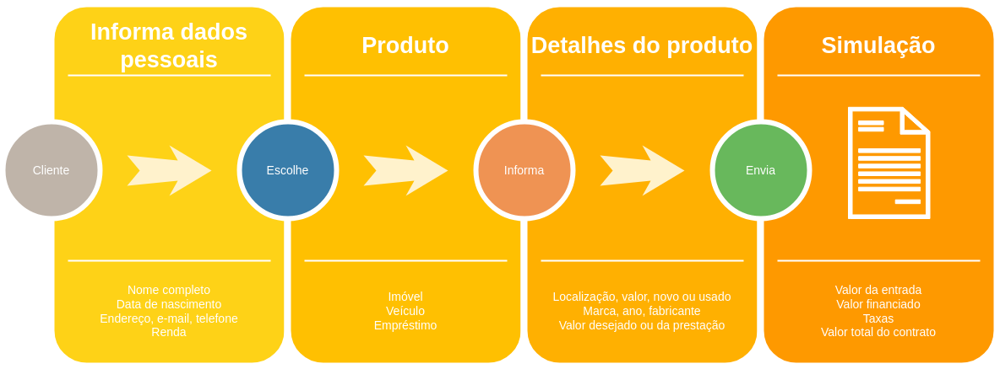
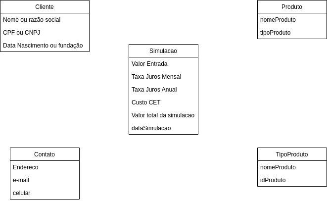
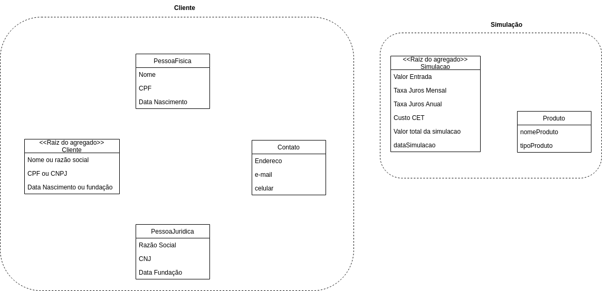
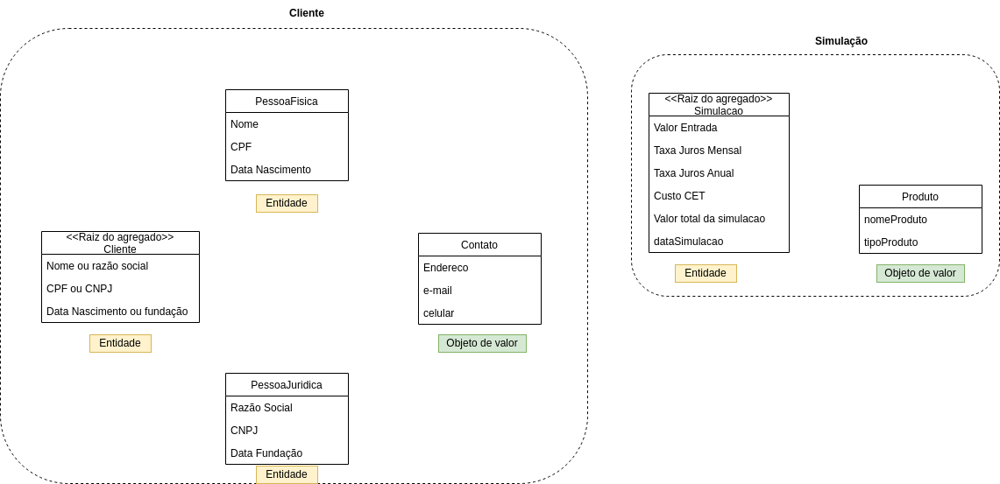
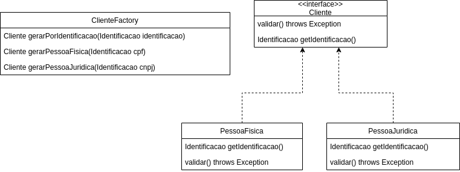
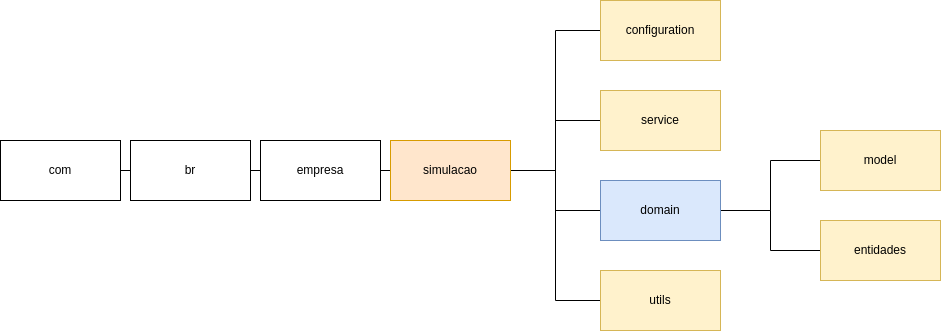
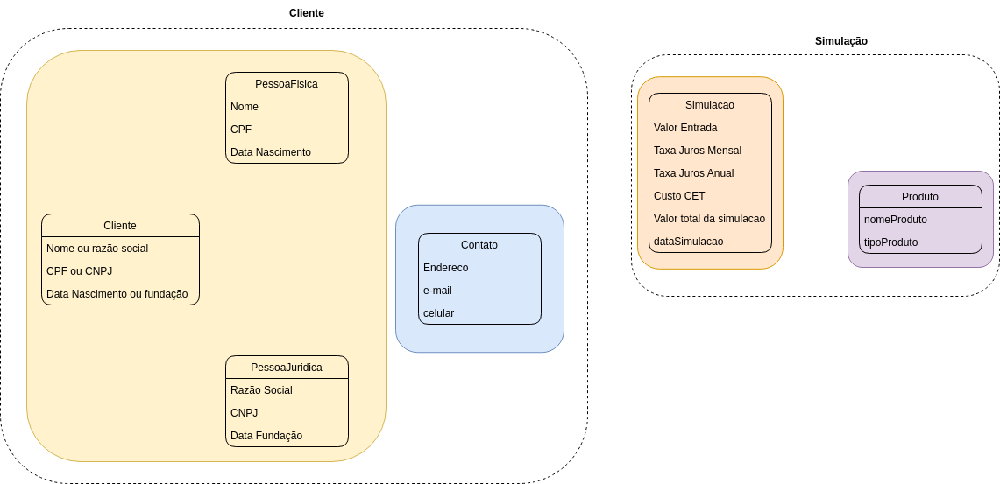

# Clean Architecture - Arquitetura Limpa
***
Projeto para colocar em prática os conceitos de Clean Architecture para dar continuidade a um projeto que foi inteiramente adequado ao DDD tático. O que em comum nesse assunto? o DDD se torna uma premissa de aplicação em projetos Clean Arch, até mesmo por quê, as aquiteturas em camadas dispostas no mercado hoje em dia são todas DDD Friendly.

## Exemplos de projetos com arquitetura limpa - clean architecture
***
Baseando-se no artigo: [Multiple ways of defining Clean Architecture layers](https://proandroiddev.com/multiple-ways-of-defining-clean-architecture-layers-bbb70afa5d4a) temos 4 branches que exemplificam maneiras possíveis de aplicar os conceitos de clean architecture em seus projetos.
1. CA-layers-single-module - Camadas em um único módulo
2. CA-one-layer-per-module - Uma camada por módulo
3. CA-layers-inside-feature-module - Camadas em um módulo de feature
4. CA-layers-per-feature-module - Camadas nos módulos das features

# Simulacao
***

A solução desse código foi feita com base na jornada:

Nesse código fonte você irá encontrar as seguintes modelagens implementadas:

### Domínio

### Agregados

### Entidades

### Fábricas

### Módulos

### Repositórios

# Run
***
Após executar a aplicação Springboot acesse: http://localhost:8080/swagger-ui/#/ ára ler a documentação da API

# Database
***
Após executar a aplicação caso queira acessar o banco de dados vá por essa url: http://localhost:8080/h2-console/